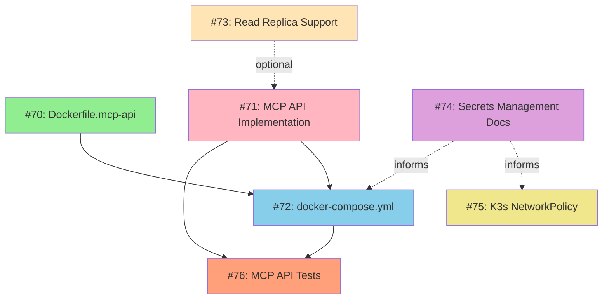

# Phase 1 Dependency Map and Implementation Ordering

## Overview
This document maps the dependencies and relationships between all Phase 1 issues in Milestone 2 (v4.0 Multi-container Architecture). It provides a recommended implementation order based on blocking dependencies.

## Dependency Graph



**Legend**:
- Solid arrows (→): Hard blocking dependency
- Dashed arrows (-.->): Optional or informational dependency
- Colors: Grouped by functional area

## Dependency Matrix

| Issue | Blocks | Blocked By | Related | Priority |
|-------|--------|------------|---------|----------|
| **#70: Dockerfile.mcp-api** | #72 | None | #71, #76 | p1-high |
| **#71: MCP API Implementation** | #76 | None | #70, #72, #73 | p0-critical |
| **#72: docker-compose.yml** | #76 | #70, #71 | #74 | p1-high |
| **#73: PostgreSQL Read Replica** | None | None | #71 | p2-medium |
| **#74: Secrets Management Docs** | None | None | #72, #75 | p1-high |
| **#75: K3s NetworkPolicy** | None | None | #74 | p1-high |
| **#76: MCP API Unit Tests** | None | #71, #72 | #70 | p1-high |

## Recommended Implementation Order

### Wave 1: Foundational Tasks (Parallel)
Can be started immediately and worked on in parallel:

1. **#70: Dockerfile.mcp-api** (2-3 days)
   - No dependencies
   - Enables containerization
   - Good first issue

2. **#71: MCP API Implementation** (5-7 days)
   - Most critical task (p0-critical)
   - Core functionality
   - Longest duration

3. **#74: Secrets Management Documentation** (2-3 days)
   - No dependencies
   - Informational task
   - Can be done by different team member

4. **#73: PostgreSQL Read Replica** (3-4 days)
   - No dependencies
   - Optional enhancement
   - Can be integrated into #71 later

### Wave 2: Integration Tasks (Sequential/Parallel)
Can start once Wave 1 tasks are complete:

5. **#72: docker-compose.yml** (1-2 days)
   - **Requires**: #70 (Dockerfile exists)
   - **Recommends**: #71 (API implemented for testing)
   - Integrates all services

6. **#75: K3s NetworkPolicy** (2-3 days)
   - **Recommends**: #74 (security best practices documented)
   - Independent security enhancement
   - Can work in parallel with #72

### Wave 3: Quality Assurance
Can start once #71 and #72 are complete:

7. **#76: MCP API Unit Tests** (3-4 days)
   - **Requires**: #71 (API code must exist)
   - **Requires**: #72 (test environment setup)
   - Final quality gate

## Critical Path Analysis

### Longest Critical Path: 8-11 days
```
#71 (MCP API: 5-7 days)
  → #72 (docker-compose: 1-2 days)
  → #76 (tests: 3-4 days)
```

**Total**: 9-13 days assuming sequential execution

### Optimized Parallel Execution: 7-10 days
```
Wave 1 (Parallel):
  - #70: Days 1-3
  - #71: Days 1-7  ← Critical path
  - #74: Days 1-3
  - #73: Days 1-4

Wave 2 (After Wave 1):
  - #72: Days 8-9   (requires #70, #71)
  - #75: Days 4-6   (parallel with Wave 1)

Wave 3 (After #71, #72):
  - #76: Days 10-13
```

**Total**: 10-13 days with optimal parallelization

## Resource Allocation Strategy

### Scenario 1: Single Developer
**Timeline**: 25-30 working days (5-6 weeks)
**Order**:
1. #70 (days 1-3)
2. #71 (days 4-10)
3. #74 (days 11-13)
4. #72 (days 14-15)
5. #73 (days 16-19)
6. #75 (days 20-22)
7. #76 (days 23-26)

### Scenario 2: Two Developers
**Timeline**: 13-16 working days (2.5-3 weeks)

**Developer A** (Backend focus):
1. #70 (days 1-3)
2. #71 (days 1-7)
3. #72 (days 8-9)
4. #76 (days 10-13)

**Developer B** (Infrastructure focus):
1. #74 (days 1-3)
2. #73 (days 4-7)
3. #75 (days 8-10)
4. Assist with #76 (days 11-13)

### Scenario 3: Student Team (3-4 developers)
**Timeline**: 10-12 working days (2 weeks)

**Developer 1** (good-first-issue):
- #70: Dockerfile.mcp-api (days 1-3)
- #72: docker-compose.yml (days 4-5)
- Support #76 (days 6-10)

**Developer 2** (experienced):
- #71: MCP API Implementation (days 1-7)
- Code review for #70, #72
- Lead #76 (days 8-10)

**Developer 3** (documentation):
- #74: Secrets Management Docs (days 1-3)
- #75: K3s NetworkPolicy (days 4-6)
- Integration testing support (days 7-10)

**Developer 4** (optional - database):
- #73: PostgreSQL Read Replica (days 1-4)
- Integration with #71 (days 5-7)
- Support #76 (days 8-10)

## Risk Mitigation

### Blocking Risk: #71 MCP API Implementation
**Impact**: Blocks #76 (tests), delays #72 (integration)
**Mitigation**:
- Start #71 immediately as highest priority
- Daily progress check-ins
- Split into smaller PRs (sessions endpoint → threats → sensors)
- Parallel work: While #71 is in progress, complete #70, #74

### Integration Risk: #72 docker-compose.yml
**Impact**: Required for local testing of #76
**Mitigation**:
- #72 can start once #70 is complete (even if #71 is partial)
- Use stub API endpoints for initial testing
- Update docker-compose as #71 progresses

### Quality Risk: #76 Tests Started Too Late
**Impact**: Bugs discovered late in cycle
**Mitigation**:
- Start test skeleton early (parallel with #71)
- Write tests for each endpoint as it's implemented
- Continuous integration from day 1

## Dependency Details

### #70 → #72 (Hard Dependency)
**Reason**: docker-compose.yml references Dockerfile.mcp-api
**Workaround**: None - #70 must complete first
**Impact**: 2-3 day delay if #70 blocked

### #71 → #76 (Hard Dependency)
**Reason**: Cannot test code that doesn't exist
**Workaround**: Write test skeleton early, update as API develops
**Impact**: Tests blocked until API implementation complete

### #71 → #72 (Soft Dependency)
**Reason**: docker-compose works better with real API service
**Workaround**: Can use stub/mock API initially
**Impact**: Low - docker-compose can evolve incrementally

### #73 → #71 (Optional Dependency)
**Reason**: MCP API can use read replica if available
**Workaround**: API falls back to primary if no replica configured
**Impact**: Performance optimization, not functional requirement

### #74 → #72, #75 (Informational)
**Reason**: Best practices inform implementation
**Workaround**: Can implement without docs (not recommended)
**Impact**: Security posture if skipped

## Integration Points

### Cross-Phase Dependencies

**Phase 1 → Phase 2**:
- #71 (MCP API) informs #77 (Coordinator service design)
- #72 (docker-compose) extended for #78 (Celery + Redis)
- #76 (test patterns) reused for #83 (Celery job tests)

**Phase 1 → Phase 3**:
- #71 (MCP API) consumed by #87 (React dashboard)
- #75 (NetworkPolicy) extended for #86 (UI backend)

**Phase 1 → Phase 5**:
- #74 (Secrets docs) referenced in #97 (security audit)
- #76 (test suite) baseline for #98 (rate limiting tests)

## Success Metrics

### Definition of Done (Phase 1 Complete)
- [x] All 7 issues closed
- [x] CI/CD pipeline green (all tests passing)
- [x] Code coverage ≥65% (target: 80% for MCP API)
- [x] Security scan passes (Trivy, docker scan)
- [x] Documentation complete (README, deployment guide)
- [x] Docker Compose works locally (dev environment)

### Key Deliverables
1. **Dockerfile.mcp-api** - Production-ready container image
2. **MCP API** - 3 endpoints functional with OpenAPI docs
3. **docker-compose.yml** - Local dev environment (PostgreSQL, Redis, MCP API)
4. **Read replica support** - Database connection routing
5. **Secrets docs** - Comprehensive security guide
6. **NetworkPolicies** - K3s/K8s network isolation manifests
7. **Test suite** - >80% coverage on MCP API

### Timeline Summary
- **Minimum (Sequential)**: 25-30 days (single developer)
- **Optimal (Parallel, 2 devs)**: 13-16 days
- **Aggressive (Student team, 3-4 devs)**: 10-12 days
- **ADR-002 Estimate**: 3 weeks (15 working days)

## Conclusion

Phase 1 can be completed in **2-3 weeks** with proper parallelization and resource allocation. The critical path is #71 (MCP API Implementation), which should start immediately as the highest priority task. All other tasks can be worked on in parallel or sequentially with minimal blocking.

**Recommended Start Order**:
1. Begin #71 (MCP API) immediately - most critical
2. Start #70, #74 in parallel - no dependencies
3. Begin #73 when resources available
4. #72 starts when #70 complete
5. #75 anytime (minimal dependencies)
6. #76 starts when #71 and #72 complete

This approach minimizes idle time and ensures the critical path (MCP API) is never blocked.
