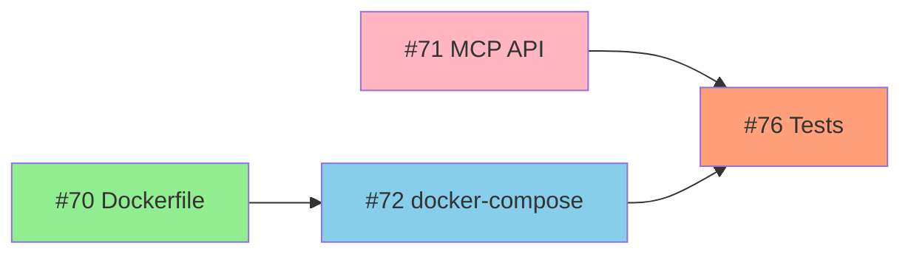

# Phase 1 Implementation Planning - Complete Summary

## Overview
All Phase 1 (Foundation) issues for Milestone 2 (v4.0 Multi-container Architecture) now have detailed implementation plans. This document provides a consolidated view of the planning effort.

## Phase 1 Issues with Implementation Plans

### Critical Priority (p0-critical)
- **#71: [Phase 1] Implement MCP Statistics Provider API endpoints**
  - [Implementation Plan](https://github.com/datagen24/cowrieprocessor/issues/71#issuecomment-3459149781)
  - Estimated: 5-7 days
  - Status: Feature, p0-critical
  - Dependencies: None
  - Blocks: #76

### High Priority (p1-high)
- **#70: [Phase 1] Create Dockerfile.mcp-api with Red Hat UBI 9 base**
  - [Implementation Plan](https://github.com/datagen24/cowrieprocessor/issues/70#issuecomment-3459147898)
  - Estimated: 2-3 days
  - Status: Good first issue, p1-high
  - Dependencies: None
  - Blocks: #72

- **#72: [Phase 1] Create docker-compose.yml for local development environment**
  - [Implementation Plan](https://github.com/datagen24/cowrieprocessor/issues/72#issuecomment-3459151965)
  - Estimated: 1-2 days
  - Status: Good first issue, p1-high
  - Dependencies: #70
  - Blocks: #76

- **#74: [Phase 1] Document secrets management with 1Password CLI and .env files**
  - [Implementation Plan](https://github.com/datagen24/cowrieprocessor/issues/74#issuecomment-3459157963)
  - Estimated: 2-3 days
  - Status: Documentation, p1-high
  - Dependencies: None

- **#75: [Phase 1] Implement K3s/K8s NetworkPolicy for service isolation**
  - [Implementation Plan](https://github.com/datagen24/cowrieprocessor/issues/75#issuecomment-3459162983)
  - Estimated: 2-3 days
  - Status: Security, p1-high
  - Dependencies: None

- **#76: [Phase 1] Create comprehensive unit test suite for MCP API**
  - [Implementation Plan](https://github.com/datagen24/cowrieprocessor/issues/76#issuecomment-3459165403)
  - Estimated: 3-4 days
  - Status: Good first issue, testing, p1-high
  - Dependencies: #71, #72

### Medium Priority (p2-medium)
- **#73: [Phase 1] Add PostgreSQL read replica connection support**
  - [Implementation Plan](https://github.com/datagen24/cowrieprocessor/issues/73#issuecomment-3459154006)
  - Estimated: 3-4 days
  - Status: Database, p2-medium
  - Dependencies: None (optional enhancement)

## Implementation Roadmap

### Recommended Execution Timeline (2-3 weeks)

**Wave 1: Foundational (Days 1-7) - Parallel Execution**
```
Developer 1: #70 (days 1-3) → #72 (days 4-5) → Support #76 (days 6-7)
Developer 2: #71 (days 1-7) - Critical path
Developer 3: #74 (days 1-3) → #75 (days 4-6)
Developer 4: #73 (days 1-4) - Optional enhancement
```

**Wave 2: Integration & Testing (Days 8-13)**
```
All developers: #76 (comprehensive testing, days 8-11)
Code review and refinement (days 12-13)
```

### Critical Path
```
#71 (MCP API: 7 days) → #72 (docker-compose: 2 days) → #76 (tests: 4 days) = 13 days
```

## Resource Requirements

### Skill Requirements by Issue

| Issue | Skills Required | Difficulty | Good First Issue |
|-------|----------------|------------|------------------|
| #70 | Docker, Python packaging | Easy | ✅ |
| #71 | FastAPI, SQLAlchemy, API design | Moderate | ❌ |
| #72 | Docker Compose, YAML | Easy | ✅ |
| #73 | SQLAlchemy, connection pooling | Moderate | ❌ |
| #74 | Technical writing, security | Easy | ❌ |
| #75 | Kubernetes, networking | Moderate | ❌ |
| #76 | pytest, testing patterns | Easy-Moderate | ✅ |

### Team Composition Recommendations

**Minimum Team (2 developers)**:
- 1 experienced backend developer (#71, #73)
- 1 DevOps/infrastructure developer (#70, #72, #75)
- Shared: #74, #76

**Optimal Team (3-4 developers)**:
- 1 senior backend developer (lead #71, review all)
- 1 DevOps specialist (#70, #72, #75)
- 1 junior developer (#70, #72, support #76)
- 1 documentation/QA (#74, lead #76)

## Deliverables

### Phase 1 Completion Criteria
- [x] Implementation plans created for all 7 issues ✅
- [ ] All Dockerfiles built and tested
- [ ] MCP API operational with 3 endpoints
- [ ] docker-compose.yml working locally
- [ ] Read replica support implemented
- [ ] Security documentation complete
- [ ] NetworkPolicies tested in K3s
- [ ] Test coverage >80% on MCP API
- [ ] CI/CD pipeline green

### Artifact Checklist
```
docker/
├── Dockerfile.mcp-api                    (#70)
└── .dockerignore

cowrieprocessor/
├── mcp/
│   ├── api.py                            (#71)
│   ├── models.py                         (#71)
│   ├── queries.py                        (#71)
│   └── deps.py                           (#71)
└── db/
    └── engine.py                         (#73 - updated)

docker-compose.yml                        (#72)
.env.example                              (#72, #74)

k8s/
└── network-policies/
    ├── 00-default-deny.yaml              (#75)
    ├── 10-mcp-api-to-postgres.yaml       (#75)
    ├── 20-coordinator-to-redis.yaml      (#75)
    ├── 30-workers-to-databases.yaml      (#75)
    └── 40-ingress-to-apis.yaml           (#75)

docs/
└── security/
    ├── README.md                         (#74)
    ├── secrets-management.md             (#74)
    ├── 1password-integration.md          (#74)
    ├── kubernetes-secrets.md             (#74)
    └── network-policies.md               (#75)

tests/
└── unit/
    └── mcp/
        ├── conftest.py                   (#76)
        ├── test_sessions_endpoint.py     (#76)
        ├── test_threats_endpoint.py      (#76)
        └── test_sensors_endpoint.py      (#76)
```

## Dependencies & Relationships

### Blocking Dependencies


### Informational Dependencies
- #74 (Secrets docs) informs #72 (docker-compose), #75 (NetworkPolicy)
- #73 (Read replica) optionally enhances #71 (MCP API)

## Success Metrics

### Phase 1 Complete When:
1. **Functional**: MCP API serves all 3 endpoints successfully
2. **Deployable**: Docker Compose brings up full stack locally
3. **Secure**: NetworkPolicies enforce isolation in K3s
4. **Documented**: All security best practices documented
5. **Tested**: Test coverage >80% on new code
6. **Automated**: CI/CD pipeline validates all changes

### Quality Gates
- ✅ Ruff lint passes (0 errors)
- ✅ Ruff format passes (no changes needed)
- ✅ MyPy type checking passes (0 errors)
- ✅ pytest coverage ≥80%
- ✅ Security scan passes (Trivy: 0 critical CVEs)
- ✅ Docker builds succeed
- ✅ docker-compose up works without errors

## Next Steps

### Immediate Actions
1. **Prioritize #71** (MCP API Implementation) - Start immediately
2. **Start good-first-issues** (#70, #72, #76) for junior developers
3. **Begin documentation** (#74) in parallel
4. **Schedule daily standups** to track critical path (#71)

### Phase 1 → Phase 2 Transition
Once Phase 1 complete:
- #77: Coordinator service for job queue management
- #78: Celery + Redis integration
- #79: Convert longtail analysis to Celery task
- #80: Convert snowshoe detection to Celery task

## Reference Documents
- **ADR-002**: Multi-Container Service Architecture (docs/ADR/002-multi-container-service-architecture.md)
- **Dependency Map**: Phase 1 Dependency Map (claudedocs/phase1_dependency_map.md)
- **CLAUDE.md**: Project architecture and development guidelines

## Summary
Phase 1 planning is **COMPLETE**. All 7 issues have detailed implementation plans with:
- Technical approach and architecture decisions
- Step-by-step implementation guides
- File locations and code structure
- Testing strategies and acceptance criteria
- Risk mitigation and estimated effort
- Dependency mapping and execution ordering

**Estimated Timeline**: 2-3 weeks (10-15 working days) with 2-4 developers working in parallel.

**Ready to begin implementation**: ✅
